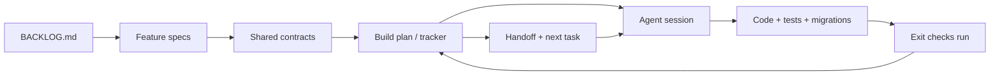

# 01 — Overview

## The problem this solves

Agentic delivery fails in predictable ways:

| Failure | Cause | This method's answer |
| --- | --- | --- |
| Each session re-plans instead of building | No authoritative "next task" | One tracker with task states and an explicit next task; the prompt forbids re-planning |
| Context is lost between sessions | History lives in chat, not the repo | Evidence, decisions and a handoff are written into the repo in the same change |
| Features drift apart | Each spec invents its own rules | A single shared-contracts document owns cross-feature policy |
| Status is optimistic | "Done" is asserted | `Verified` requires named commands and outcomes; `Released` is separate |
| Destructive accidents | Agent has shared data or deploy access in reach | Disposable targets where needed, explicit authorisation boundaries |
| Sessions stop after a scaffold | Prompt is ambiguous about depth | The prompt demands coherent slices: user-visible behaviour, applicable tests and docs |

## What the method optimises for

**Resumability.** Any competent session can pick the repository up cold and continue.

**Truthfulness.** The repository never claims more than was demonstrated.

**Bounded autonomy.** The agent decides routine things itself and records them.
It asks only when information is genuinely missing, or when an action leaves the
authorised, reversible zone.

**Coherent slices.** A task delivers a usable increment — for a static app this
may be browser behaviour, data/configuration, tests and documentation; a
service-backed product may also include schema, service and interface changes.

## The loop

Design flows down once. Status and evidence flow back every session. The prompt
is constant; only the tracker changes. Architecture and verification checks are
selected from the real product profile rather than copied as universal layers.

## Non-goals

- It is not a substitute for human product judgement. Someone still decides what
  is worth building and when it ships.
- It does not assume parallel agents. Dependencies are technical facts, not an
  instruction to fan out.
- It is not heavyweight process. Keep documents short and include only those relevant to the project.
