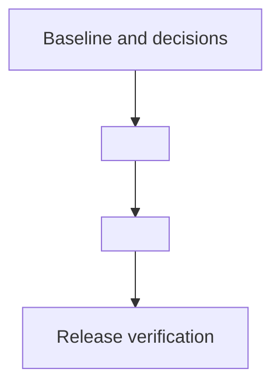

# Feature build plan and delivery tracker

Last updated: <!-- FILL: date -->.
Overall state: <!-- FILL: e.g. F00 verified; all features unreleased. -->
Next task: **<!-- FILL: ID - name -->.**

Use this as the execution and progress record for the [feature specifications](README.md). Follow the [shared contracts](shared-contracts.md) for cross-feature policy. Use the [implementation prompt](build-prompt.md) to start or resume work.

## How to maintain this plan

1. Read the current task table, decisions and handoff before editing code. Verify repository state and preserve unrelated changes.
2. Select the next unfinished task whose prerequisites are verified. Set it to `In progress` and record the actual scope.
3. Implement the feature slice, migrations, checks and documentation together. Record any changed design in the shared contracts and affected specifications.
4. Update the table with paths or commit references, commands and outcomes. Never invent a commit, deployment or test result.
5. Set `Verified` only after the task's exit checks pass. Set `Blocked` with the specific dependency or missing input, then continue an independent ready task where possible.
6. Update the handoff and delivery log at the end of each implementation session. Synchronise the feature summary, backlog and feature status when a feature meets its release gate.
7. Keep this file small. Delivery-log entries are one or two lines. When a task is Verified, move its task details and older log entries to `delivery-archive.md`; keep only its tracker row with a short evidence summary.

Task states: `Not started`, `In progress`, `Blocked`, `Verified`. Feature release states: `Not released`, `Ready for release`, `Released`. `Verified` means implementation and checks are complete, not that production is deployed. Record deployment environment and evidence separately.

## Scope and dependencies

Default work order is the table order below. <!-- FILL: which tasks may proceed early. --> This describes technical dependencies, not a requirement to use parallel agents.

## Feature progress

| Feature | Required tasks | Release state | Evidence |
| --- | --- | --- | --- |
| <!-- FILL --> | <!-- FILL: task IDs --> | Not released | <!-- FILL: honest status, naming what is verified and what is pending --> |

## Task tracker

Dependencies mean verified prerequisites, unless a task explicitly documents a safe independent substep. Detailed exit checks follow the table.

| ID | Task | Depends on | State | Evidence / blocker |
| --- | --- | --- | --- | --- |
| F00 | Baseline, repeatable checks and implementation decisions | None | Not started | — |
| F01 | <!-- FILL --> | F00 | Not started | — |
| F02 | <!-- FILL --> | F01 | Not started | — |
| R01 | Cross-feature regression, release readiness and rollout records | All implementation tasks for the release slice, excluding R01 | Not started | — |

## Task details and exit checks

For each task, record the changed surface/risk, focused iteration command, final
required gates and their applicability, and checks intentionally out of scope.
Reuse current passing evidence only while its relevant inputs are unchanged.
Stop when acceptance criteria and required gates have evidence; do not rerun broad
suites after documentation-only evidence updates. Existing explicit requirements
remain mandatory until an approved policy change.

### F00 — baseline and decisions

- Inspect current application entry points, data/configuration, build/test and deployment workflows. Compare code to specifications rather than assuming feature titles imply implementation.
- Apply [the solution pattern](../solution-pattern.md), recording existing behaviour and any required departures.
- Document and run the actual local install/start/build/test commands. Add wrappers, containers or disposable resources only if the chosen profile needs them.
- Capture existing build and test results, including pre-existing failures. Check relevant browser/platform behaviour and deployment paths separately.
- Record which commands include other checks (for example, a browser command that builds first), and when each standing check applies. Do not default documentation-only tasks to application suites.
- For static apps, verify generated output, asset/base paths, hash/deep routes and the main browser journey as applicable. For stateful systems, verify disposable setup and owned-resource cleanup.
- Inspect any existing migration mechanism before changing it. Database-specific checks are not applicable when the product has no database.
- Record required decisions before the affected infrastructure work; list each
  decision ID and its gated tasks in the Decisions table.
- Compare workflows with `architecture/alm.md` when that contract exists. Record missing infrastructure or recovery work only when required by the selected profile.
- Exit: reproducible baseline, actual commands and observed results, applicable browser/deployment checks, and a bounded implementation scope recorded in the handoff. Record unavailable checks as pending with a follow-up; do not imply platform or deployment success from static review.

### F01 — <!-- FILL -->

- <!-- FILL: the concrete work -->
- Exit: <!-- FILL: adversarial checks, what must be absent, and which checks are release checks rather than task checks -->

### F02 — <!-- FILL -->

- <!-- FILL: the concrete work -->
- Exit: <!-- FILL: checks and required outcomes -->

### R01 - release verification

- Follow the project's release contract, if present. For static apps verify the
  source revision, built artifact, configured base path/routes and published
  browser journey; for service-backed apps verify only their applicable runtime,
  data and recovery gates.
- Local exit: applicable regressions pass and release evidence/limitations are
  recorded. Keep real-host checks separate from local `Verified` status.
- Release gate: authorised publication and relevant deployed user journeys pass,
  with source/artifact evidence recorded. Do not require database recovery or
  server readiness for a static app that owns neither.

## Decisions

| ID | Date | Question | Decision | Gates |
| --- | --- | --- | --- | --- |
| D-01 | <!-- FILL --> | <!-- FILL --> | <!-- FILL --> | <!-- FILL: tasks that must not proceed without it --> |

## Delivery log

<!-- Newest first. One entry per session. -->

- **<!-- FILL: date -->** — <!-- FILL: task IDs, what was delivered, commands run and outcomes. -->

## Current handoff

<!--
Write this so a cold session can resume without asking anything.
-->

- Starting point: <!-- FILL: commit, tree state -->
- Completed this session: <!-- FILL: task IDs and user-visible changes -->
- In flight: <!-- FILL: any In progress task and exactly where it stopped -->
- Checks run: <!-- FILL: commands and outcomes -->
- Blockers and pending release checks: <!-- FILL -->
- **Next task: <!-- FILL: ID -->. First step: <!-- FILL -->.**
