# 08 - ALM pattern: GitHub, Azure and PostgreSQL

This is an optional application lifecycle management (ALM) pattern for projects
that need a service-backed Azure deployment. It captures the repository and
environment layout established in `feedback.mightora.io`: one product repository,
isolated sandbox and production environments, GitHub Actions, Bicep, containerised
APIs on Azure, and **Azure Database for PostgreSQL Flexible Server in production**.

The delivery method remains language-independent. Select this hosting pattern
only when product requirements call for its services. A static browser app can
use GitHub Pages or another static host and does not need this guide, PostgreSQL,
Azure resources or an `architecture/alm.md` file. For an existing project, record
gaps and migration tasks only when such a migration is actually required; adopting
the pack does not authorise infrastructure changes. Production PostgreSQL means
PostgreSQL, not Azure SQL or SQL Server.

Sections below define the future-project standard. The final section records
which parts the reference repository actually implements. Copy and complete
[the project ALM template](../templates/architecture/alm.md) when this pattern is selected.
The [solution pattern](../templates/architecture/solution-pattern.md) describes
the optional reference application, login and Windows/Codespaces test contract;
this guide owns the Azure environment and deployment pattern when adopted.

## 1. Repository ownership and layout

Keep application source, database migrations, infrastructure, deployment workflows
and delivery evidence in the same product repository. Environments are deployments
of that source; do not create separate sandbox and production code repositories.
Use separate repositories only for independently versioned products or shared
packages, with an explicit compatibility contract.

```text
<product>/
  AGENTS.md
  BACKLOG.md
  .github/skills/               Core and selected profile skills (if installed here)
  .github/workflows/
    ci.yml                      PR and release validation; no deployment secrets
    backend.yml                 Ordered Azure infrastructure/API/frontend release
    frontend.yml                Optional frontend-only redeploy
  backend/
    src/                        API and optional worker entry points
    db/schema.sql               Empty-database bootstrap only, if needed
    db/migrations/              Ordered, immutable upgrade migrations
    scripts/                    Disposable integration runner
    test/
    Dockerfile
    .env.template               Names and safe local defaults; no real credentials
  frontend/                     Source, generated-page templates and tests
    .env.template               Public build settings only
  architecture/
    alm.md                      This project's environment and release contract
    conceptual-model.md
    high-level-design.md
    solution-pattern.md         Application, login and local/test requirements
    requirements-matrix.md
    deploy/
      main.bicep                Resource-group-scoped entry point
      resources.bicep           Shared resources with explicit environment choices
      <optional-worker>.bicep   Independently scheduled background work
    features/                   Specs, one tracker, baseline and task records
  scripts/                      Local start/stop and operator setup helpers
  docker-compose.yml            Persistent local development dependencies
```

This is a responsibility map, not a promise that the pack ships deployable YAML
or Bicep. Implement those files for each product and use that stack's dependency
lockfiles. Keep real `.env` files, deployment parameter files, credentials and
transient build/test output out of Git. Where generated pages are tracked, change
their source templates and rebuild them.

## 2. Environment and branch contract

| Target | Source / trigger | Database | Data and purpose |
| --- | --- | --- | --- |
| Local development | Any working branch; explicit local start | Local PostgreSQL container with persistent volume | Synthetic developer data; convenient repeated manual use |
| Disposable verification | Local test runner or PR CI | A new PostgreSQL container/database per run | Destructive tests; runner owns provisioning and cleanup |
| `sandbox` | Merge/push to `sandbox`; guarded manual dispatch | Single-instance containerised PostgreSQL with persistent Azure Files, or managed PostgreSQL when parity is needed | Shared integration and acceptance; synthetic data only |
| `production` | Merge/push to protected `main`; guarded manual dispatch | Azure Database for PostgreSQL Flexible Server | Durable customer data, backups, monitored operation |

Use `feature/<description>` branches for implementation. Validate the candidate
in `sandbox`, then promote the reviewed change through a pull request to `main`.
Production fixes also go through review and checks; bring them back into sandbox
before the next promotion. Avoid branch-only configuration or environment-specific
code forks: supply configuration through GitHub Environments and Bicep parameters.

Create GitHub Environments named exactly `sandbox` and `production`, each with
its own configuration and secrets. Create separate Azure resource groups such as
`rg-<product>-sandbox` and `rg-<product>-production`. Each environment owns its
database, registry, Container Apps environment/API, frontend storage and secrets.
Never fall back to production credentials, endpoints or data for a missing sandbox
setting. Separate subscriptions are an option when the isolation requirement
justifies them; separate resource groups are the baseline.

Only `refs/heads/main` may target production and only `refs/heads/sandbox` may
target sandbox. Reject other refs, including tags, on manual dispatch. Enforce
this in workflow conditions and environment deployment-branch rules. A generic
"anything other than main is sandbox" fallback is not the future-project standard.
Apply the same check to frontend-only workflows. Configure required PR checks and
the project's release-review policy; record any GitHub-plan limitations.

Record the sandbox source commit and production source commit. If merging creates
a new SHA, revalidate that resulting commit; sandbox evidence for an earlier SHA
does not prove the final release passed. Branch promotion never promotes a database
or copies sandbox records into production.

## 3. Azure infrastructure contract

Use parameterised Bicep at resource-group scope. Create the resource groups,
provider registrations and deployment identity permissions once as operator
bootstrap. Routine deployments reconcile resources within the selected group.
Azure documents [resource-group-scoped Bicep deployments](https://learn.microsoft.com/en-us/azure/azure-resource-manager/bicep/deploy-to-resource-group).

Define these responsibilities in the templates:

| Resource | Responsibility |
| --- | --- |
| Azure Container Registry (ACR) | Versioned backend/worker images |
| Container Apps environment and API | HTTPS API, environment configuration, explicit CPU/memory and replica bounds |
| Log Analytics | Application/startup logs with a documented retention period |
| PostgreSQL | Containerised sandbox option; managed Flexible Server for production |
| Key Vault / Container Apps secrets | Secret storage and runtime injection; document the actual consumption path |
| Azure Storage static website | Independent frontend assets and URL per environment |
| Container Apps Job, when needed | Scheduled work that continues while the API is idle or scaled to zero |

Pass stable names and URLs between pipeline jobs as Bicep outputs, rather than
rediscovering resources with name-substring searches. Parameterise the product
slug, region, environment, database name, sizes, scaling and frontend origin.
Allowlist environment values; shorten `production` to `prod` for resource naming
only, not for branch or secret selection. Keep naming suffixes stable across runs.

Start production APIs with at least one warm replica and permit sandbox APIs to
scale to zero unless a recorded workload decision requires otherwise. A warm
replica is a latency choice, not proof of high availability or zero-downtime
deployment. Set explicit limits and an operating budget per project.

### Database lifecycle

Use the same PostgreSQL major and required extensions in development, disposable
tests, sandbox and production. The reference uses PostgreSQL 16; choose a supported
version when adopting the pattern and record it rather than copying ageing tags.

Production must use encrypted database transport with certificate verification,
explicit network access, no demo seeding, and managed backups. Record backup
retention, high-availability choice, recovery point objective (acceptable data
loss) and recovery time objective (acceptable outage). Test a restore into a
separate target before claiming recovery is verified. Flexible Server supports
[automatic backups and point-in-time recovery](https://learn.microsoft.com/en-us/azure/postgresql/backup-restore/concepts-backup-restore);
choosing the service does not establish a tested recovery procedure.

The cheaper sandbox database is deliberately lower assurance: no managed backup
or HA guarantee, internal-only database ingress, one writer and one data volume.
Azure Files persistence survives normal container replacement; it is not a backup.
Validate image-specific user/group IDs and mount permissions using the current
[Container Apps storage guidance](https://learn.microsoft.com/en-us/azure/container-apps/storage-mounts).
Prevent overlapping PostgreSQL revisions from writing the same directory: a
one-replica limit alone does not guarantee this during rollout. Use managed
PostgreSQL for sandbox when testing managed-service networking, restore or HA,
and record this as a parity exception to the default containerised sandbox.
Shared sandbox is never the target of destructive integration suites.

Treat migrations as part of the application release. Apply ordered, additive
migrations with a checksum ledger, a transaction per migration and a database
advisory lock shared with bootstrap. Refuse a destructive base schema on any
non-empty database. Never edit applied migrations. Verify fresh bootstrap,
representative upgrades, concurrent startup and repeat startup in disposable
databases. Small bounded migrations can run before API readiness; long-running or
incompatible changes need a separate migration stage and an explicit rollout plan.
Use expand/migrate/contract changes so old and new application revisions can coexist.

## 4. Backend-led deployment pipeline

The standard sequence is:

```mermaid
flowchart LR
    Change[Reviewed commit] --> Check[Build and disposable checks]
    Check --> Select[Validate ref and environment configuration]
    Select --> Infra[OIDC login and Bicep reconciliation]
    Infra --> Image[Build and push versioned image to ACR]
    Image --> API[Update API and apply migrations]
    API --> Health[Verify application readiness and revision]
    Health --> Web[Build and publish environment frontend]
    Web --> Evidence[Smoke checks and release evidence]
```



1. **Validate before mutation.** CI installs locked dependencies, builds/tests the
   affected layers, runs the disposable database checks and compiles Bicep. Make
   these required before deployment of the release commit. Keep PR validation
   independent of Azure credentials. Record exact commands in the baseline.
2. **Select and preflight.** Resolve branch to an allowed environment, bind every
   deployment job to that GitHub Environment, and check required configuration
   before Azure changes. Report missing names, never secret values. Serialise
   deployments by product/environment and do not cancel a release mid-migration.
   Coordinate optional frontend-only jobs with that same deployment lock.
3. **Reconcile infrastructure.** Authenticate through GitHub OIDC. Preserve the
   currently deployed image during infrastructure reconciliation. A public
   bootstrap image may be needed on the first run before ACR contains the API;
   that placeholder must never satisfy application readiness. Use secure Bicep
   parameters, serialised as JSON in an owner-readable runner-temp file, and
   remove it in unconditional cleanup. Infrastructure reconciliation can change
   live configuration: review material changes; it is not a read-only check.
4. **Build and deploy.** Build the backend Dockerfile, push a commit-addressed
   image, record its digest and deploy that digest or an immutable release tag.
   Do not select `latest` for a release or rollback. Authenticate ACR pushes via
   the Azure identity (`az acr login`). Use managed identity for runtime image
   pulls where configured; pipeline authentication and runtime pulls are separate.
5. **Verify the API.** Wait with a bounded timeout for database initialisation,
   migration completion and application readiness. Verify an application-specific
   response and the expected running revision/image, not just HTTP 200 from a
   placeholder or older revision. Fail the release if it cannot be verified.
6. **Publish the frontend.** Only after API verification, build with that
   environment's public API URL and base path, then publish to its static host.
   Test deep links, the custom domain, CORS and authentication return URLs. Keep
   backend-only secrets out of frontend build variables and generated assets.
7. **Record the release.** Capture workflow run, source SHA, image digest,
   environment, migration level, frontend build, URLs and smoke-check results.
   A successful infrastructure deployment alone cannot set `Released`.

Build per environment is the reference's approach; it does not demonstrate
promotion of the same binary. If a project requires build-once promotion, copy
the verified backend digest to the production registry and verify it is unchanged.
Frontend bundles may differ because their public API URL is baked in; record those
artifacts separately or deliberately adopt runtime frontend configuration.

Default to deploying on pushes to the two environment branches, plus guarded
manual dispatch. If adding path filters, include backend, frontend, infrastructure,
workflows, lockfiles and shared build inputs; document what cannot trigger a
release. A documentation push can deploy when no path filters exist.

## 5. Identity, configuration and frontend hosting

Use [GitHub OIDC with Azure Login](https://learn.microsoft.com/en-us/azure/developer/github/connect-from-azure-openid-connect)
for deployment, with `contents: read` and `id-token: write` on jobs that need it.
Scope deployment rights to the target resource group. Prefer distinct sandbox
and production deployment identities so a sandbox identity cannot mutate production.
If Bicep creates role assignments, provide the additional RBAC permissions or
move those assignments to operator bootstrap; Contributor alone is insufficient.
Document any broader role grant rather than silently giving subscription Owner.

Configure federated trust for each environment using the repository's actual OIDC
subject, issuer and audience. Do not copy the reference repository's IDs. Subject
formats may include immutable owner/repository IDs or custom claims; inspect the
configured format and follow [GitHub's OIDC reference](https://docs.github.com/en/actions/reference/security/oidc).
Do not put tokens into logs to diagnose a mismatch.

| Configuration | Location / handling |
| --- | --- |
| Azure client, tenant and subscription IDs; region; public URLs | GitHub Environment variables, or secrets if organisation policy requires; workflow lookup must match |
| Database password, signing/encryption keys, provider credentials | Separate GitHub Environment secrets; secure parameters and runtime secret references |
| Public frontend API URL / base path | Build variables such as `VITE_API_URL` and `VITE_BASE_PATH`; visible to the browser |
| Local development settings | Ignored `.env` from a safe `.env.template` |
| One-time identity/resource setup | Operator runbook in `architecture/alm.md`; no credentials in the document |

Retain signing/encryption keys across deployments and plan rotation separately.
Use a least-privilege runtime database identity and a separately controlled
migration identity where schema changes need elevated rights. Provider identities
(for example, a mail-sending application) are independent of the deployment
identity and are included only when the product needs them.

Both hosted environments use Azure Storage static websites in this pattern.
An optional edge/custom-domain service, such as the reference's Cloudflare Worker
static assets, must keep sandbox and production targets separate. Azure's static
website endpoint serves public content; an edge layer does not itself make the
origin private. See [Azure Storage static website access](https://learn.microsoft.com/en-us/azure/storage/blobs/storage-blob-static-website).
Choose and document a different host if private frontend access is required.

## 6. Release, recovery and adoption evidence

Keep environment configuration and operating procedures in `architecture/alm.md`.
Keep task/release status in `architecture/features/build-plan.md`, and commands,
outcomes and limitations in the baseline or linked task records. Do not introduce
a second release tracker.

Before the first production release, demonstrate local/disposable setup and
cleanup, sandbox deployment, migration compatibility, real-host smoke checks,
environment isolation, and a recovery rehearsal. Record monitoring ownership for
API errors/readiness, failed jobs, database capacity and backup/restore operation.
Container image rollback and database recovery are separate procedures: redeploy
a compatible retained image/artifact for an application fault; use a reviewed
restore or fix-forward plan for data/schema faults. An older image with an older
migration ledger may refuse to start against the newer schema. Never automatically
re-run the base schema, reverse migrations or restore over the live database.

For a partial release (API succeeds, frontend fails), record each component's
actual version and recover the failed stage with compatible retained artifacts.
Evidence and explicit release criteria determine status; a retry is not proof.
Pushes and deployments remain within the user's existing authorisation, as set
 out in [the safety rails](../../agentic-delivery/method/06-safety-rails.md).

## 7. Reference implementation and adoption gaps

Inspected in `feedback.mightora.io` at commit `2760a7f` on 5 October 2026. This is
source inspection, not verification of live GitHub settings or Azure resources.
Paths below belong to that reference repository; they are not files shipped by
this portable pack.

| Source | Observed implementation / limitation |
| --- | --- |
| `.github/workflows/backend.yml` | Every push to `main` or `sandbox`, plus manual dispatch; no path filters. Jobs reconcile Bicep, push/deploy the SHA-tagged API, check `/api/health`, then publish the frontend. No PR/test gate is defined here; readiness does not prove the expected SHA. Dispatch maps all non-main refs to sandbox. |
| `.github/workflows/frontend.yml` | Manual production-only Azure Storage redeploy, with optional Cloudflare publishing. It has no explicit main-ref guard and uses a separate concurrency group from the backend-led release. |
| `architecture/deploy/main.bicep` and `resources.bicep` | Resource-group scope; sandbox container PostgreSQL, otherwise Flexible Server 16, 32 GiB, seven-day backups, no explicit HA, geo-redundant backup disabled. API minimum replicas: production 1, others 0; maximum 2. These sizes are reference choices, not universal requirements. |
| `resources.bicep` identity/network settings | OIDC is used by CI, but API image pulls use ACR admin credentials. Database credentials use the administrator; the database URL is copied into Key Vault and a Container Apps secret, not consumed through a Key Vault reference. Production has an `AllowAllAzureServices` firewall rule, not a private-only network. Future projects must resolve/document these access choices. |
| `backend/src/db.ts`, `backend/src/migrations.ts`, `backend/db/migrations/` | Empty-only bootstrap, optional sandbox seed, advisory lock, ordered checksum ledger and transactional migrations. Old binaries missing applied migrations cannot simply roll back. |
| `backend/scripts/test-disposable.cjs`, `docker-compose.yml`, `scripts/local-test.*` | Disposable verification is separate from the persistent local development stack. Destructive suites require their disposable guard. |
| `architecture/deploy/delivery-worker.bicep` | Optional scheduled job; not invoked by the main template or deployment workflow. Its presence does not mean background delivery is deployed. |
| `wrangler.toml` and the workflows | Azure Storage hosts both environments; Cloudflare Worker assets are optional. Older README/architecture statements about automatic GitHub Pages releases and path-filtered deploys are not the current workflow. |

Do not blindly copy the workflows as a compliant starter. Add the required CI and
ref guards, coordinate deployment concurrency, select maintained tool/image
versions, verify runtime identities/networking and complete the project release
and recovery checks. Track gaps as implementation work; this document changes no
pipeline or cloud resources.
