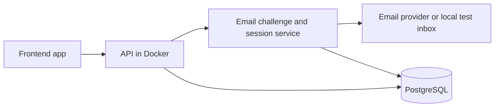

# Service-backed solution pattern

Use this template as `architecture/solution-pattern.md` only when the product
needs a server-side runtime, server-enforced identity/authorization, shared
persistence, private secrets or server-side work. This is a project contract,
not evidence of implementation. The [high-level design](high-level-design.md)
records the chosen architecture; the [baseline](features/baseline.md) records
executed checks. The shared delivery method and tracker follow the
agentic-delivery core skill.

## Reference full-stack pattern

The following Docker/PostgreSQL/email-challenge pattern is a reference for
projects that choose those capabilities, not a universal service-backed mandate.
Its "required" steps apply only to projects adopting that reference stack.
Select only applicable sections and replace example choices with the project's
real stack. Preserve existing behaviour and record departures; explicit user
requirements take precedence. Azure ALM is an independent opt-in within this
profile. For other stacks, document equivalent safe checks in the project's
solution pattern and baseline instead of copying irrelevant requirements.

### Application and hosting

- Deliver a browser-based frontend application backed by an API. Keep credentials,
  authorisation and database access on the server.
- Use email address sign-in with both a magic link and a 10-character one-time
  code in the same email. Apply the shared challenge contract below.
- Package the backend and any workers as Docker images for hosting. Serve a
  static frontend from static hosting or a web container; containerise its server
  too if it needs a server runtime. The framework and hosting provider can vary.
- Use PostgreSQL in every environment. Use managed PostgreSQL in production and optionally in sandbox when managed-service
  parity is required by the ALM contract; local development, Codespaces and disposable tests
  use PostgreSQL containers. A Docker database runs the same engine, not a mock
  or a different lightweight database.



| Environment | Application | PostgreSQL | Sign-in email |
| --- | --- | --- | --- |
| Windows development | Local dev servers or Docker app services | Docker container with separate development data | Local test inbox or controlled mail adapter |
| GitHub Codespaces | Same app and Docker setup, with browser port forwarding | Container within the development environment | Same local inbox or adapter |
| Automated tests / CI | Repeatable build and test commands | A new disposable container/database per run | Captured test mail; no real delivery |
| Sandbox (default hosted target) | Docker API/workers, frontend preview | Isolated persistent container with synthetic data, or managed PostgreSQL for parity | Controlled test destinations only |
| Production | Docker API/workers and the chosen frontend host | Managed PostgreSQL with persistent storage and backups | Configured production mail provider |

Use the same PostgreSQL major version, required extensions and migration files
locally and in production. Record the chosen version and observed image digest.
Apply ordered, versioned migrations; test both a fresh database and a
representative upgrade against disposable data. Never reset a shared database
to make a test pass. Production adds TLS, secret management, least-privilege
database access and a documented backup/restore procedure. Container tests alone
do not verify managed-service configuration or recovery.

### Email sign-in contract

1. The user enters their email address. Return a generic acknowledgement and
   send one message containing a magic link and an exactly **10-character
   alphanumeric code**. Make the code case-insensitive and avoid ambiguous
   characters when generating it; validate and normalise input server-side.
2. Generate the code and a separate high-entropy link token using a cryptographic
   random generator. Store hashes, expiry and attempt state, not raw credentials.
   Do not put raw codes or tokens in application logs.
3. Both credentials belong to one challenge, valid for **10 minutes** by default.
   Atomically consume it when either succeeds: neither credential may be used
   again, including during concurrent code/link requests.
4. A magic link opens a confirmation page. Only an explicit confirmation redeems
   it; GET requests and email previews must not consume the challenge. Support
   opening the email in a fresh browser without prior local state.
5. Default to a **90-second resend cooldown**. Requests during the cooldown do
   not send another message or extend expiry; a permitted resend invalidates the
   previous code and link together. Bound failed attempts and rate-limit request
   and verification endpoints; record project-specific limits in shared contracts.
6. Build links from the configured frontend public origin and route, including
   any hosting subpath. Do not trust arbitrary return URLs or request host headers.
   Keep tokens out of analytics and referrers and remove them from the visible
   URL after the confirmation flow.
7. Issue the normal app session only after successful verification. Email
   ownership establishes identity; server-side membership and role checks still
   determine access. Record session lifetime, logout/revocation and any account
   creation or invitation policy in shared contracts.

Local testing must exercise this same flow through a local inbox or test mail
adapter. No production mail credentials or authentication bypass should be needed
to sign in locally. Keep the test mail facility confined to development/tests.

Required auth checks: code and link success; case handling and exact code length;
fresh-browser link confirmation; previews not redeeming links; wrong, expired and
reused credentials; resend invalidation/cooldown; attempt and rate limits;
concurrent redemption with only one winner; unauthorised resource access denied.

### Reference-stack scripts and local environment (when adopted)

Generate and maintain working scripts as part of F00 and update them whenever
startup, configuration, migrations or verification changes. Written commands,
TODO stubs and a successful manual run do not replace the scripts. Generate them
for the target project's real stack; this pack supplies the contract, not a
universal executable launcher.

| Required entry point | Purpose |
| --- | --- |
| `scripts/local-test.ps1` | Start PostgreSQL in Docker plus the app and test inbox for manual testing on Windows |
| `scripts/local-test.sh` | Equivalent launcher for Bash/Linux and GitHub Codespaces |
| `scripts/test.ps1` | Run repeatable automated verification on Windows and exit with its result |
| `scripts/test.sh` | Run the equivalent automated checks in Codespaces/Linux and CI |

Shared portable implementation code is encouraged, with thin PowerShell and
Bash entry points. Existing equivalent names may be retained if both platform
commands and their roles are explicitly documented. A launcher that only starts
services is not an automated test runner.

Also deliver the Dockerfile(s), Docker Compose configuration, non-secret
environment templates, dependency lockfiles where applicable, and
`.devcontainer/devcontainer.json` with the
required runtime, Docker/Compose access and app port forwarding. Record whether
app processes run on the host/dev container or in Docker; both platforms must
support the documented choice without a cloud account or production credentials.

### Common script behaviour

- Resolve paths relative to the script, so invocation works outside the repo root
  and from paths containing spaces. Support explicit port/config overrides.
- Check Docker CLI, a reachable daemon, Compose and required runtimes up front.
  Report actionable prerequisite failures and return a nonzero exit code.
- Use reproducible dependency installation from the stack's lockfiles where
  applicable and initialise missing local config
  from safe templates. Preserve existing local config and keep secrets untracked.
  Automated tests must override inherited database URLs and real mail settings.
- Start dependencies, wait with bounded readiness checks, apply migrations, then
  check the API and frontend. A running container is not proof of database
  readiness; use a healthcheck or explicit probe. See
  [Docker's startup-order guidance](https://docs.docker.com/compose/how-tos/startup-order/).
- The launcher prints the app, sign-in, inbox and health URLs plus log locations
  and stop/reset instructions. It supports a repeat run and Ctrl+C cleanup.
  Clearly state whether development database data is retained after stopping;
  reset must be explicit.
- The automated runner provisions uniquely identified disposable test resources,
  supplies the project's test marker and database-name guard, and runs the
  documented builds, unit/integration checks and applicable browser smoke tests.
  Failures, including cleanup failures, must produce a nonzero exit code.
- On success, failure or interruption, clean up only processes, containers,
  networks and test volumes owned by this invocation. Track ownership rather
  than killing every process on a port. Never use broad Docker prune commands
  or delete a developer's existing volume. Document recovery after forced termination.

### Windows requirements (when supporting the reference stack on Windows)

- Support Windows PowerShell 5.1 and PowerShell 7 with Docker Desktop running Linux
  containers. Do not require Bash, WSL shell commands or Unix utilities in `.ps1`.
- Quote paths and pass argument arrays correctly. When applicable, resolve
  `npm.cmd` explicitly. Check native-command exit codes; PowerShell error handling
  alone does not guarantee that a failed native command stops the script.
- Use `try`/`finally` for cleanup and stop only the child process trees created
  by the script. Document prerequisites and a one-command invocation.

### GitHub Codespaces requirements (when supporting Codespaces)

- Make the Bash scripts work in the configured Linux dev container with Docker
  and Compose available; do not assume Docker Desktop or Windows paths.
  Keep shell files LF-terminated, for example through `.gitattributes`.
- Configure and document app port forwarding. Prefer a frontend proxy to the
  internal API so browser requests use one origin. Keep database and test inbox
  access private. GitHub documents forwarded URLs and visibility in
  [forwarding ports](https://docs.github.com/en/codespaces/developing-in-a-codespace/forwarding-ports-in-your-codespace).
- Use the browser-accessible forwarded frontend URL for email links. Health
  probes and container connections use internal addresses, not that public URL.
  Derive the origin from `CODESPACE_NAME` and
  `GITHUB_CODESPACES_PORT_FORWARDING_DOMAIN` when available, with an explicit
  override; see [Codespaces environment variables](https://docs.github.com/en/codespaces/developing-in-a-codespace/default-environment-variables-for-your-codespace).
- If separate API/browser origins are necessary, allow only the exact configured
  origins and verify the session works through the forwarding layer. Never allow
  every `*.app.github.dev` origin or require public ports as a shortcut.

### Reference-stack verification and completion

Document these commands in the project's README and baseline after generating
the real scripts (names below are the default contract):

```powershell
.\scripts\local-test.ps1
.\scripts\test.ps1
```

```bash
bash scripts/local-test.sh
bash scripts/test.sh
```

Run the launcher for manual checks, stop it using the documented procedure, then
run the automated command. Keep development and automated test data separate.

Record platform, runtime/Docker versions, exact commands, outcomes, test counts
and cleanup evidence for Windows and Codespaces separately. Demonstrate fresh
startup, restart with retained development data, schema setup, email code/link
login, a representative app journey, automated pass/failure exit codes and
cleanup after failure/interruption. Verify the app's Docker image builds and
starts against a disposable PostgreSQL instance before claiming hosting readiness.

Linux CI can verify the Bash runner, but does not prove Codespaces browser
forwarding or Windows behaviour. If a platform is unavailable, deliver its
scripts, record that platform as unverified and retain a named verification task;
do not claim both platforms work based on static review. Recheck affected scripts
as the app changes. Real mail delivery, deployed origin/session configuration and
production PostgreSQL operations remain distinct release checks.
