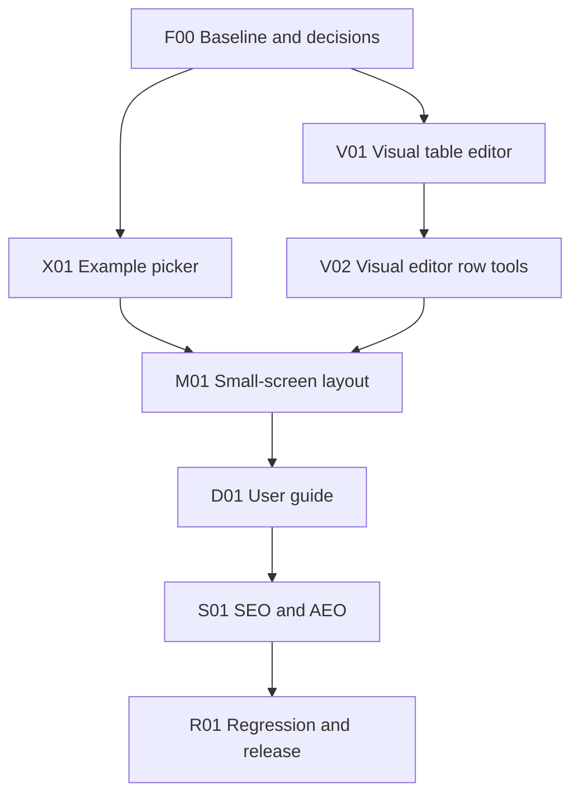

# Feature build plan and delivery tracker

Last updated: 2026-10-07.
Overall state: F00 verified; product feature implementation not started; all features unreleased.
Next task: **X01 - Example picker drop-down.**

Use this as the execution and progress record for the Technology Radar Live Editor improvements. Use the [implementation prompt](build-prompt.md) to start or resume work. Architecture profile: **static-web-delivery** (browser-only, GitHub Pages; no backend, sign-in or database).

## How to maintain this plan

1. Read the current task table, decisions and handoff before editing code. Verify repository state with `git status` and preserve unrelated changes.
2. Select the next unfinished task whose prerequisites are verified. Set it to `In progress` and record the actual scope.
3. Implement the feature slice, checks and documentation together. Record any changed design in the shared contracts and affected specifications.
4. Update the table with paths or commit references, commands and outcomes. Never invent a commit, deployment or test result.
5. Set `Verified` only after the task's exit checks pass. Set `Blocked` with the specific dependency or missing input, then continue an independent ready task where possible.
6. Update the handoff and delivery log at the end of each session. Synchronise `BACKLOG.md` when a feature meets its release gate.

Task states: `Not started`, `In progress`, `Blocked`, `Verified`. Feature release states: `Not released`, `Ready for release`, `Released`. `Verified` means implemented and checked locally, not deployed. Pushing to `main` deploys via [.github/workflows/pages.yml](../../.github/workflows/pages.yml), so pushes require explicit user authorisation.

## Requested features

| # | User request | Workstream |
| --- | --- | --- |
| 1 | Drop-down to choose an example instead of typing a name | X01 |
| 2 | WYSIWYG editor as an alternative to the raw CSV editor | V01, V02 |
| 3 | Good layout on small screens | M01 |
| 4 | Documentation on how to use the tool | D01 |
| 5 | SEO and AEO (answer-engine) enrichment | S01 |

## Scope and dependencies

Default work order is the table order. X01 and V01 are independent once F00 is verified. S01 metadata that does not depend on guide content (meta tags, robots, canonical) is a safe independent substep after D-01 is decided. This describes technical order, not a requirement for parallel agents.

## Feature progress

| Feature | Required tasks | Release state | Evidence |
| --- | --- | --- | --- |
| Example picker | X01 | Not released | Not started |
| Visual (WYSIWYG) editor | V01, V02 | Not released | Not started |
| Small-screen layout | M01 | Not released | Not started |
| User documentation | D01 | Not released | Not started |
| SEO / AEO enrichment | S01 | Not released | Not started |

## Task tracker

| ID | Task | Depends on | State | Evidence / blocker |
| --- | --- | --- | --- | --- |
| F00 | Baseline, method bootstrap and decisions | None | Verified | Added method docs and Playwright smoke test. `npm install` passed (0 vulnerabilities); `npm run check`, `npm test`, `npm run build` passed; `npm run test:e2e` passed (1/1); local browser confirmed listed findings. See [baseline](baseline.md). |
| X01 | Example picker drop-down | F00 | Not started | — |
| V01 | Visual table editor with two-way CSV sync | F00, D-02 | Not started | — |
| V02 | Visual editor row tools (add, delete, duplicate, filter) | V01 | Not started | — |
| M01 | Small-screen responsive layout | X01, V02, D-04 | Not started | — |
| D01 | User guide and in-app documentation link | M01, D-03 | Not started | — |
| S01 | SEO and AEO enrichment | D01, D-01 | Not started | — |
| R01 | Cross-feature regression and release readiness | X01, V01, V02, M01, D01, S01 | Not started | — |

## Task details and exit checks

### F00 — baseline, method bootstrap and decisions

- Bootstrap the method from `.github/skills/agentic-delivery/templates/` and `.github/skills/static-web-delivery/templates/architecture/solution-pattern.md`: create `AGENTS.md`, `BACKLOG.md` (the five requests above, verbatim), `architecture/solution-pattern.md`, `architecture/high-level-design.md`, `architecture/features/README.md`, `architecture/features/shared-contracts.md` and `architecture/features/baseline.md`. Keep shared contracts short: CSV schema (six required columns), `radar-definition.yaml` as the status/dot vocabulary, `localStorage` key `radar-builder-source`, share payload v1 per [docs/sharing.md](../../docs/sharing.md). Link the existing [design-system.instructions.md](../../design-system.instructions.md) from `AGENTS.md`; do not overwrite it.
- Run and record: `npm install`, `npm run check`, `npm test`, `npm run build`, then serve `dist` (`python -m http.server 8080 -d dist`) and walk the main journey in a browser.
- Record these pre-inspection findings and confirm them against the running app:
  - Examples use `window.prompt()` with a free-text name ([src/app.js](../../src/app.js), `examplesButton` handler, `EXAMPLE_FILES` map).
  - `loadShared()` is defined but never called, so `#/view/` and `#/edit/` links may not load their payload. Record as a pre-existing defect; see D-05.
  - Header nav links to `#examples`, which has no matching element.
  - Documentation button opens the GitHub repository; there is no user guide.
  - `<head>` has only `title`, `viewport`, `theme-color`; no description, canonical, Open Graph, structured data, `robots.txt` or `sitemap.xml`. The `<h1>` is overwritten at runtime with the radar name.
  - [scripts/smoke-test.mjs](../../scripts/smoke-test.mjs) asserts source text only; there are no behavioural or browser tests.
  - [scripts/build.mjs](../../scripts/build.mjs) copies only `index.html`, `src/`, `public/`; any new root files (guide, robots, sitemap) need adding.
- Install Playwright per D-04, add a minimal e2e test that loads the built app and asserts the radar SVG renders, and record its command and outcome.
- D-01 and D-04 are decided; ask the user for D-05 if still pending.
- Exit: baseline.md lists actual commands with observed outcomes, the findings above confirmed or corrected, browser checks performed (browser + viewport) and checks not performed marked pending.

### X01 — example picker drop-down

- Replace the `prompt()` flow with an accessible `<select>` (labelled "Load example") populated from `EXAMPLE_FILES`, with a placeholder option. Selecting loads the file; keep the existing "Replace the current source?" confirmation when `state.dirty`. Cancelling confirmation resets the select to the placeholder.
- Either repurpose the `Examples` toolbar button into the select or place the select in the toolbar; give it `id="examples"` (or equivalent anchor) so the header nav link resolves.
- Loading an example goes through `setSource()` so undo/redo and `localStorage` behave as for other edits (note: `setSource` currently does not persist to `localStorage`; persist consistently).
- Add behavioural tests for: list matches files in `public/examples/`, every example parses with zero validation errors.
- Exit: no `prompt(` call remains for examples; every example loads from the select in a browser; cancel leaves source unchanged; failed fetch shows the toast and leaves source unchanged; keyboard-only selection works; undo restores the prior source; `npm run check`, `npm test`, `npm run build` pass.

### V01 — visual table editor with two-way CSV sync

- Add an editor mode switch inside the Editor panel: `Visual` | `CSV`. CSV text remains the single source of truth (D-02); the visual editor reads parsed rows and writes back via `csvString()` + `setSource()`.
- Render a table with one row per technology: text inputs for Radar Name, Category, Sub Category, Technology; `<select>` for Status and Dot Status populated from the loaded YAML config. Offer `<datalist>` suggestions for Radar Name/Category/Sub Category from existing values.
- Per-cell validation: highlight cells referenced by `validate()` errors and expose the message via `aria-describedby`.
- When the CSV cannot be parsed (e.g. unclosed quote, wrong headers), the visual editor shows a read-only notice with a "Switch to CSV to fix" action and never overwrites the source.
- Remember the chosen mode in `localStorage`.
- No new runtime dependency.
- Exit: edits in Visual update CSV text, preview and error count after debounce; edits in CSV update Visual on switch; round-trip of every example through Visual → CSV produces identical parsed rows; values containing commas, quotes and newlines survive round-trip; invalid CSV is never rewritten by the visual editor; undo/redo covers visual edits; all user values rendered via `escapeHtml` or DOM properties (no HTML injection from CSV cells); keyboard Tab order moves across cells.

### V02 — visual editor row tools

- Add row, delete row, duplicate row, move up/down; a text filter to narrow visible rows; a radar-name filter aligned with the preview's radar selector.
- New rows default Status/Dot Status to the first configured values.
- Exit: each operation is a single undo step; deleting the last row leaves a valid header-only CSV; filter never drops hidden rows from the written CSV; duplicate rows surface the existing "Duplicate technology entry" error; screen reader labels on icon buttons.

### M01 — small-screen responsive layout

- Audit at 360, 390, 768 and 1024 px widths. Target: no horizontal page scroll; toolbar wraps or collapses into an overflow menu with primary actions (Examples, Share) visible; tabs scroll horizontally or stack without clipping; touch targets at least 44×44 px.
- Visual editor: switch to a stacked card-per-row layout below a breakpoint (labels visible per field).
- CSV editor: line numbers stay aligned; font size at least 16 px on inputs to avoid iOS zoom.
- Radar preview: SVG scales to width; legend moves below the radar; category labels do not clip (adjust `viewBox` padding if needed); toggling labels remains available.
- Share dialog fits within the viewport with scrollable content.
- Respect `<mightora-header>` built-in mobile menu; do not duplicate it. Follow [design-system.instructions.md](../../design-system.instructions.md) focus styles.
- Exit: screenshots or recorded browser checks at each width for Editor (both modes), Preview, Errors, Exports and Share dialog; no horizontal overflow (`document.documentElement.scrollWidth <= innerWidth`); desktop layout unchanged at 1280 px; print view unaffected. Real-device checks (iOS Safari, Android Chrome) are release checks if not available locally.

### D01 — user guide and in-app documentation

- Create a static, crawlable guide page (D-03, proposed `guide/index.html`) using the same header, author and footer components. Sections: What is a technology radar; Quick start; Loading an example; Visual editor; CSV editor and required columns; Statuses and dot statuses (generated from or kept in sync with `radar-definition.yaml`); Validation errors; Sharing (link to privacy warning, encoded not encrypted); Exports; Using on mobile; Privacy and data; FAQ.
- Point the toolbar `Documentation` button and header nav `Documentation` link at the guide. Keep the GitHub link as a separate nav item.
- Update [README.md](../../README.md) with a short usage section linking the guide; keep [docs/sharing.md](../../docs/sharing.md) as the technical format reference.
- Update `scripts/build.mjs` to copy the guide into `dist`.
- Exit: every documented control exists with the documented name; guide renders with no console errors and passes the M01 widths; internal links and anchors resolve in `dist`; test asserts the built guide exists and the docs button targets it.

### S01 — SEO and AEO enrichment

- Head metadata on `index.html` and the guide: unique `<title>`, `meta description`, `link rel="canonical"` (D-01), Open Graph and Twitter card tags, `og:image` (static radar PNG in `public/`), `lang`, `robots`.
- Structured data (JSON-LD): `WebApplication` (name, url, applicationCategory, operatingSystem "Any (browser)", offers price 0, author Ian Tweedie / publisher Mightora) on the app; `HowTo` and `FAQPage` on the guide, with text matching visible content exactly; `BreadcrumbList` on the guide.
- Crawlable content: keep a static `<h1>` for the product name (render the radar name in a separate element rather than overwriting the `<h1>`); add a short visible, static description and a `<noscript>` summary so non-JS crawlers see meaningful text.
- Root files: `robots.txt` (allow all, reference sitemap), `sitemap.xml` (app + guide), `llms.txt` (concise product summary, features, guide and FAQ links) for answer engines. Add them to `scripts/build.mjs`.
- AEO content rules: FAQ answers lead with a direct one-to-two sentence answer; define "technology radar", rings and dot statuses in plain language; state privacy facts (local-first, no account, no upload).
- Do not add analytics, tracking or third-party SEO scripts.
- Exit: JSON-LD parses as valid JSON and matches visible text; built `dist` contains `robots.txt`, `sitemap.xml`, `llms.txt`, OG image; canonical URLs are absolute and match D-01; `<h1>` text is constant after a radar loads; tests assert presence of these tags/files. Release checks: Google Rich Results Test and a social card preview against the deployed URL; Search Console sitemap submission (user action).

### R01 — regression and release readiness

- Re-run all checks; browser journey on desktop and mobile widths: load each example, edit in both modes, validate errors, share link generate/open (subject to D-05), all five exports, guide navigation.
- Confirm `dist` contents and that `pages.yml` builds the same artifact.
- Local exit: all checks pass and limitations recorded. Release gate: user-authorised push to `main`, successful Pages run, and the deployed journey plus S01 release checks pass on the live URL.

## Decisions

| ID | Date | Question | Decision | Gates |
| --- | --- | --- | --- | --- |
| D-01 | 2026-10-07 | Canonical production URL and base path? | Decided (user): `https://radar.mightora.io/` at root. Custom domain is configured outside the repo (no `CNAME` file); verify on the live host in R01. | S01 |
| D-02 | 2026-10-07 | How should the WYSIWYG editor relate to CSV? | Proposed: dependency-free table/grid editor; CSV text remains canonical; visual edits serialise via `csvString()`. | V01 |
| D-03 | 2026-10-07 | Where does user documentation live? | Proposed: static `guide/index.html` deployed with the app (crawlable, shareable), linked from header and toolbar. | D01, S01 |
| D-04 | 2026-10-07 | Browser test tooling? | Decided (user): add `@playwright/test` as a devDependency for viewport and journey checks. Set up in F00 (`playwright.config.js`, `npm run test:e2e` against built `dist`, Chromium minimum); local test passed. Not added to `pages.yml`: CI browser installation/reliability has not yet been verified. | M01, R01 |
| D-05 | 2026-10-07 | Fix the uncalled `loadShared()` share-link defect? | Pending user: proposed fix in X01's slice (one-line boot call + test) because R01 verifies sharing. | R01 |

## Delivery log

- **2026-10-07** — User confirmed D-01 (`https://radar.mightora.io/`) and D-04 (Playwright approved). D-05 still pending.
- **2026-10-07** — Plan created from repository inspection. No code changed; no checks run.
- **2026-10-07** — F00 verified. Bootstrapped `AGENTS.md`, `BACKLOG.md`, `architecture/solution-pattern.md`, `architecture/high-level-design.md`, `architecture/features/README.md`, `shared-contracts.md`, and `baseline.md`; documented local commands in `README.md`; added Playwright Chromium smoke test. `npm install` -> 0 vulnerabilities; `npm run check` -> passed; `npm test` -> passed; `npm run build` -> passed; `npm run test:e2e` -> 1/1 passed. Local browser confirmed the listed behavior gaps and reproduced D-05. Pending viewport, real-device, and deployed-host checks are in `baseline.md`.
- **2026-10-07** — CI repair locally verified: run `37627582404` failed in Pages configuration after a successful build. Separated `.github/workflows/pages.yml` build/artifact upload from dependent deployment with deployment-only write permissions and the `github-pages` environment; added workflow smoke assertions and README setup instructions. Regression test failed before the fix and passed afterward; `npm run check`, `npm test`, `npm run build`, `npm run test:e2e` (1/1), and `git diff --check` passed. Release remains blocked pending maintainer Pages setup and a successful live deployment; no feature release state changed. See [baseline](baseline.md).

## Current handoff

- Starting point: `main` at `afdd89bbeacb70b7ca2f3892208426f1baae247e`; the untracked `architecture/` plan and prompt were preserved.
- Completed this session: F00 verified. Added delivery guidance/contracts/baseline docs and an e2e Playwright smoke test; no application behavior was changed.
- Checks run: `npm install` -> success, zero vulnerabilities; `npm run check` -> passed; `npm test` -> passed; `npm run build` -> passed; `npm run test:e2e` -> 1/1 passed using locally served `dist`. Local browser findings and the `/data/config.json` 404 are recorded in `baseline.md`.
- Blockers and pending release checks: D-05 needs user confirmation; it gates only the proposed X01 share-link fix, not X01's example picker or other feature tasks. Real-device and deployed-URL checks remain pending. Pages deployment additionally requires a maintainer to select Settings → Pages → Source → GitHub Actions and verify Pages availability, then rerun the workflow; the CI repair is locally verified only.
- **Next task: X01 - Example picker drop-down. First step: confirm whether to include the proposed D-05 share-link fix in X01; then mark X01 In progress and implement the accessible example selector.**
