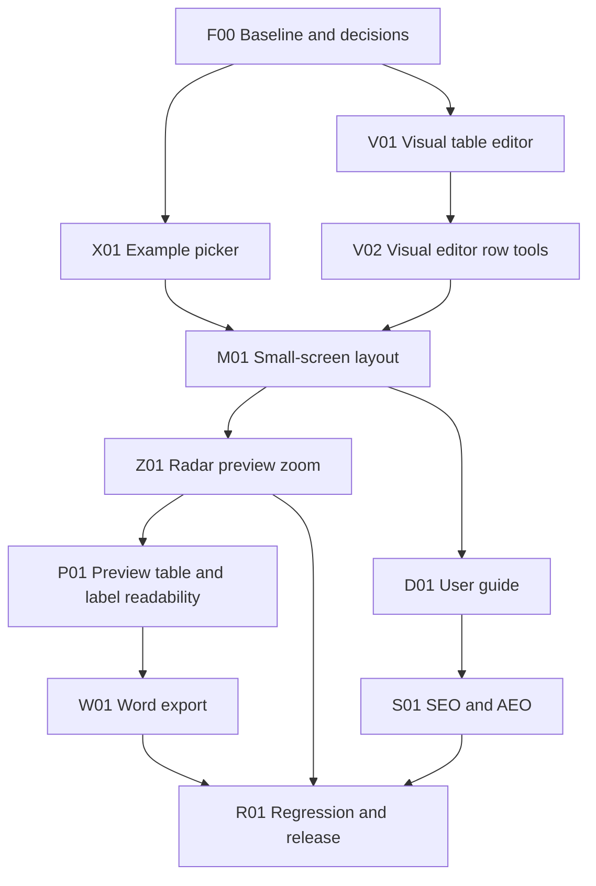

# Feature build plan and delivery tracker

Last updated: 2026-10-08.
Overall state: F00, X01, V01, V02, M01 and D01 verified; product features unreleased.
Current task: **W01 - Word-compatible radar export follow-up; CI01 build fix verified locally.**
Next planned task: **Z01 - Radar preview zoom controls.**

Use this as the execution and progress record for the Technology Radar Live Editor improvements. Use the [implementation prompt](build-prompt.md) to start or resume work. Architecture profile: **static-web-delivery** (browser-only, GitHub Pages; no backend, sign-in or database).

## How to maintain this plan

1. Read the current task table, decisions and handoff before editing code. Verify repository state with `git status` and preserve unrelated changes.
2. Select the next unfinished task whose prerequisites are verified. Set it to `In progress` and record the actual scope.
3. Implement the feature slice, checks and documentation together. Record any changed design in the shared contracts and affected specifications.
4. Update the table with paths or commit references, commands and outcomes. Never invent a commit, deployment or test result.
5. Set `Verified` only after the task's exit checks pass. Set `Blocked` with the specific dependency or missing input, then continue an independent ready task where possible.
6. Update the handoff and delivery log at the end of each session. Synchronise `BACKLOG.md` when a feature meets its release gate.
7. Keep this file small. Delivery-log entries are one or two lines. When a task is Verified, move its task details and older log entries to the [delivery archive](delivery-archive.md); keep only its tracker row with a short evidence summary.

Task states: `Not started`, `In progress`, `Blocked`, `Verified`. Feature release states: `Not released`, `Ready for release`, `Released`. `Verified` means implemented and checked locally, not deployed. Pushing to `main` deploys via [.github/workflows/pages.yml](../../.github/workflows/pages.yml), so pushes require explicit user authorisation.

## Requested features

| # | User request | Workstream |
| --- | --- | --- |
| 1 | Drop-down to choose an example instead of typing a name | X01 |
| 2 | WYSIWYG editor as an alternative to the raw CSV editor | V01, V02 |
| 3 | Good layout on small screens | M01 |
| 4 | Documentation on how to use the tool | D01 |
| 5 | SEO and AEO (answer-engine) enrichment | S01 |
| 6 | Zoom in and out on the radar preview | Z01 |
| 7 | Improve radar preview readability and show its technologies in a formatted table | P01 |
| 8 | Export a radar to a Word-compatible document | W01 |
| 9 | Edit values beneath the radar on click, save on blur, and curve category/subcategory names around nested radar sections | P02 |
| 10 | Adjustable radar text size and fewer overlapping points | P03 |

## Scope and dependencies

Default work order is the table order. X01 and V01 are independent once F00 is verified. S01 metadata that does not depend on guide content (meta tags, robots, canonical) is a safe independent substep after D-01 is decided. This describes technical order, not a requirement for parallel agents.

## Feature progress

| Feature | Required tasks | Release state | Evidence |
| --- | --- | --- | --- |
| Example picker | X01 | Not released | X01 verified locally; see task evidence below. |
| Visual (WYSIWYG) editor | V01, V02 | Not released | V01 and V02 verified locally; release gate remains R01. |
| Small-screen layout | M01 | Not released | M01 verified locally; see task evidence below. |
| Radar preview zoom | Z01 | Not released | Planned; not started. |
| Preview readability and technology table | P01 | Not released | Verified locally: translucent label backgrounds and an accessible, responsive technology table; 9 focused and 34 full-suite Chromium checks passed. Z01 integration remains pending. |
| Word export | W01 | Not released | Genuine `.docx` with embedded radar PNG capped at 4096 px and editable tables; focused resolution test passes. Word-app rendering remains pending. |
| Inline preview editing and nested radar sections | P02 | Not released | Implemented locally with transparent outer labels; initial focused 13/13 passed. Full suite 36/38; preview test race corrected, rerun skipped by user. |
| User documentation | D01 | Not released | D01 verified locally; static guide, navigation and build checks passed. Release gate remains R01. |
| SEO / AEO enrichment | S01 | Not released | In progress: add app/guide metadata and structured data, crawlable static app text, root discovery files, and focused checks. |

## Task tracker

| ID | Task | Depends on | State | Evidence / blocker |
| --- | --- | --- | --- | --- |
| F00 | Baseline, method bootstrap and decisions | None | Verified | Added method docs and Playwright smoke test. `npm install` passed (0 vulnerabilities); `npm run check`, `npm test`, `npm run build` passed; `npm run test:e2e` passed (1/1); local browser confirmed listed findings. See [baseline](baseline.md). |
| X01 | Example picker drop-down | F00 | Verified | Accessible picker and D-05 shared-link loading verified. `npm run check`, `npm test`, `npm run build` passed; `npm run test:e2e` passed (4/4), including seven examples and v1 view/edit links overriding stored source. Integrated browser loaded a generated view link, showed Preview, and hid Editor. |
| V01 | Visual table editor with two-way CSV sync | F00, D-02 | Verified | Dependency-free Visual/CSV editor with round-trip, validation, invalid-source, undo/redo, persistence, and keyboard checks; see V01 delivery log. |
| V02 | Visual editor row tools (add, delete, duplicate, move, filter) | V01 | Verified | `npm run check`, `npm test`, `npm run build` passed; final `npm run test:e2e` passed 14/14 (6 V02 tests). Single-step undo, header-only deletion, configured defaults, hidden-row preservation, duplicate validation, accessible buttons and keyboard journeys at five widths passed. See [implementation record](v02-visual-row-tools.md) and [baseline](baseline.md). |
| M01 | Small-screen responsive layout | X01, V02, D-04 | Verified | Preview-first startup and cohesive workspace tabs; responsive checks at 360, 390, 768, 1024 and 1280 px. `npm run check`, `npm test`, `npm run build`, and `npm run test:e2e` passed; 15/15 browser tests, no viewport overflow. Real-device checks remain pending. |
| Z01 | Radar preview zoom controls | M01, D-04 | Not started | Add accessible zoom in/out and reset controls for the radar itself; preserve ring/sector meaning, responsive fit, and export behavior. |
| P01 | Preview label readability and formatted technology table | Z01 | Verified | Translucent gray label backing and a six-column technology table follow the selected radar's last-valid rows. Keyboard, safe rendering, SVG/PNG exports and 360/390/768/1024/1280 px checks passed; check, smoke, build and 34/34 Chromium tests passed. Explicitly implemented before outstanding Z01; recheck zoom integration there. See [archive](delivery-archive.md) and [baseline](baseline.md). |
| W01 | Word-compatible radar export | P01 | In progress | Client-generated `.docx` with embedded PNG radar capped at 4096 px and editable status/category matrix and six-column technology table. Focused Playwright package/resolution test passed 1/1. Word-app import remains pending. |
| P02 | Inline preview editing and curved category/subcategory sections | P01 | In progress | Six-column click/blur edits and transparent outer labels implemented; focused 13/13 passed, syntax/smoke/build passed, full browser run 36/38. Preview share test race corrected but rerun skipped; unrelated unregistered-example failure remains. See baseline. |
| P03 | Adjustable radar text and collision-aware point placement | P01 | In progress | Implemented 8-20 px slider, wrapped/measured labels and collision-aware placement. Focused Node geometry checks, syntax and build passed; npm test fails the existing guide/example mismatch after radar assertions pass. E2e explicitly skipped; browser/keyboard/export checks pending. |
| D01 | User guide and in-app documentation link | M01, D-03 | Verified | Static guide, shared components, Documentation links, README and build copy implemented. `npm run check`, `npm test`, `npm run build` (inside browser command) passed; `npm run test:e2e` passed 22/22, including 7 guide tests. Crawlable without JS; local links/anchors, control names, keyboard and 360/390/768/1024/1280 px checks passed without guide console errors or page overflow. See [implementation record](d01-user-guide.md) and [baseline](baseline.md). |
| S01 | SEO and AEO enrichment | D01, D-01 | In progress | Add canonical/social metadata and JSON-LD to app and guide; publish robots.txt, sitemap.xml and llms.txt plus a static OG image; keep the app H1 unchanged by loaded CSV data. |
| R01 | Cross-feature regression and release readiness | X01, V01, V02, M01, Z01, P01, W01, D01, S01 | Not started | — |
| T01 | Playwright task-scoped authoring and local result runners | F00 | Verified | Both local runners passed all checks and 25/25 browser tests; each saved logs, summary, browser artifacts and HTML report under `test-results/local-*`. See [baseline](baseline.md). |
| H01 | Share radar-only page and image links | X01, P01 | In progress | Share dialog adds Radar page link (`#/embed/`, optional `table` flag, iframe code) and Image link (SVG/PNG data URL, `` code). Check and build passed; npm test fails only the existing guide/example mismatch. E2e skipped by request; browser checks pending. |
| CI01 | Fix failing Pages build guide/example check | D01 | Verified | Guide lists all 17 registered examples; regression checks their loading section. Focused Node check, syntax, smoke and build pass. Browser checks: focused 1/7, full 30/39; CDN DNS failures and two unchanged preview-table failures remain. Workflow/editor unchanged; hosted CI rerun pending. |

## Task details and exit checks

Only unfinished tasks are listed. Details for Verified tasks (F00, X01, V01, V02, M01, D01, T01) are in the [delivery archive](delivery-archive.md).

### Z01 — radar preview zoom controls

- Add keyboard-accessible Zoom in, Zoom out and Reset zoom controls to Preview; zoom only the radar graphic, not the page or legend.
- Keep the radar centered and usable at 360, 390, 768, 1024 and 1280 px; prevent category labels from clipping at supported zoom levels.
- Keep zoom as transient view state: do not modify CSV, localStorage, undo history or share payload v1. Reset zoom returns to the default fit.
- SVG, PNG and print output use the default fitted radar, independent of the current on-screen zoom.
- Exit: controls work by mouse and keyboard, have accessible names and stable hit areas, cannot zoom beyond documented bounds, reset returns to fit, no viewport overflow occurs, exports are unscaled, and existing radar/share behavior still passes focused browser tests.

### W01 — Word-compatible radar export

- Add a Word-compatible export to the existing export controls for the selected radar, including its formatted technology table.
- Generate the file in the browser without uploading user data or adding a runtime dependency; choose and record the actual file format during implementation.
- Exit: downloaded output opens in a supported Word-compatible application, includes the selected radar and its technologies with useful formatting, handles CSV-derived content safely, and does not change other export behavior.

### S01 — SEO and AEO enrichment

- Head metadata on `index.html` and the guide: unique `<title>`, `meta description`, `link rel="canonical"` (D-01), Open Graph and Twitter card tags, `og:image` (static radar PNG in `public/`), `lang`, `robots`.
- Structured data (JSON-LD): `WebApplication` (name, url, applicationCategory, operatingSystem "Any (browser)", offers price 0, author Ian Tweedie / publisher Mightora) on the app; `HowTo` and `FAQPage` on the guide, with text matching visible content exactly; `BreadcrumbList` on the guide.
- Crawlable content: keep a static `<h1>` for the product name (render the radar name in a separate element rather than overwriting the `<h1>`); add a short visible, static description and a `<noscript>` summary so non-JS crawlers see meaningful text.
- Root files: `robots.txt` (allow all, reference sitemap), `sitemap.xml` (app + guide), `llms.txt` (concise product summary, features, guide and FAQ links) for answer engines. Add them to `scripts/build.mjs`.
- AEO content rules: FAQ answers lead with a direct one-to-two sentence answer; define "technology radar", rings and dot statuses in plain language; state privacy facts (local-first, no account, no upload).
- Do not add analytics, tracking or third-party SEO scripts.
- Exit: JSON-LD parses as valid JSON and matches visible text; built `dist` contains `robots.txt`, `sitemap.xml`, `llms.txt`, OG image; canonical URLs are absolute and match D-01; `<h1>` text is constant after a radar loads; tests assert presence of these tags/files. Release checks: Google Rich Results Test and a social card preview against the deployed URL; Search Console sitemap submission (user action).

### R01 — regression and release readiness

- Re-run all checks; browser journey on desktop and mobile widths: load each example, edit in both modes, validate errors, share link generate/open (subject to D-05), all exports including Word, guide navigation.
- Confirm `dist` contents and that `pages.yml` builds the same artifact.
- Local exit: all checks pass and limitations recorded. Release gate: user-authorised push to `main`, successful Pages run, and the deployed journey plus S01 release checks pass on the live URL.

### P02 scope and exit checks

- Click or keyboard-activate any preview-table value, edit it, and commit on blur; Escape cancels. Preserve selected-radar filtering, CSV escaping, persistence, validation and single-step undo/redo.
- Group radar sections by category and subdivide each category by its own subcategories. Curve category labels around the outer edge and subcategory labels just inside them; position each technology in its matching subsection and configured status ring.
- Category/subcategory text and category bands have transparent backgrounds; retain technology label backing, including exports.
- Verify keyboard editing, stale-source handling, safe values, SVG/PNG exports and layout at 360/390/768/1024/1280 px, then run required repository checks. Preserve pre-existing uncommitted work; no deployment.

### P03 scope and exit checks

- Temporary radar text-size slider: 8-20 px, default 11; resize technology and curved category/subcategory labels, retaining image/print typography without CSV/storage/history/share changes.
- Measure and wrap technology names; choose dot and label positions without changing status rings or subsection membership. Retry crowded layouts with a larger fitted drawing area; bound retries to avoid unbounded work. Beyond that bound, extremely dense data can still overlap.
- Focused Node checks cover collision bounds, ring/subsection membership, empty input, wrapping and deterministic layout. Browser checks for visual clarity, keyboard/viewport behavior and exports remain pending because the user explicitly requested no e2e tests. Do not mark Verified until required pending checks pass.

## Decisions

| ID | Date | Question | Decision | Gates |
| --- | --- | --- | --- | --- |
| D-01 | 2026-10-07 | Canonical production URL and base path? | Decided (user): `https://radar.mightora.io/` at root. Custom domain is configured outside the repo (no `CNAME` file); verify on the live host in R01. | S01 |
| D-02 | 2026-10-07 | How should the WYSIWYG editor relate to CSV? | Decided: dependency-free, DOM-built table; CSV text remains canonical and visual edits serialize through `csvString()` and `setSource()` semantics. Use textareas for text cells to preserve embedded newlines; remember mode in `radar-builder-editor-mode`. | V01 |
| D-03 | 2026-10-08 | Where does user documentation live? | Decided (D01): static `guide/index.html`, copied into `dist/guide/index.html`, linked from header and toolbar. Use relative links for the app/guide round trip. Keep vocabulary synchronized with YAML through tests; guide content and table of contents remain readable without JavaScript. | D01, S01 |
| D-04 | 2026-10-07 | Browser test tooling? | Decided (user): add `@playwright/test` as a devDependency for viewport and journey checks. Set up in F00 (`playwright.config.js`, `npm run test:e2e` against built `dist`, Chromium minimum); local test passed. Not added to `pages.yml`: CI browser installation/reliability has not yet been verified. | M01, R01 |
| D-05 | 2026-10-07 | Fix the uncalled `loadShared()` share-link defect? | Decided (user, 2026-10-07): fix in X01 by loading a valid v1 share payload during startup before falling back to localStorage; test view and edit links. Preserve payload format and privacy warning. | X01, R01 |
| D-06 | 2026-10-07 | Row ordering, filter scope and new-row defaults? | Decided (V02): move against adjacent source rows, including hidden rows; case-insensitive text search across all six cells; radar filter shares the preview selection. Filters are temporary view state, do not write CSV or add history/storage keys. Add appends, clears text search, inherits the selected radar, uses the first configured status/dot labels and focuses the first empty field. Duplicate preserves every value; existing validation reports duplicates. | V02 |
| D-07 | 2026-10-08 | P01 table data, layout and label treatment? | Decided: reuse `radarRows()` in source order with all six CSV columns, including Radar Name for All radars; text-only DOM cells, caption and scoped headers in a keyboard-scrollable region. Keep the last-valid rows and show a stale-data notice on errors. Use an SVG-contained 85% opaque light-gray label filter and fallback text attributes so the backing survives SVG/PNG downloads. | P01 |
| D-08 | 2026-10-08 | Adjustable radar typography and point spacing? | P03: 8-20 SVG px, default 11; transient view state including export typography. Measure/wrap names and deterministically check dot/label boxes, expanding the fitted drawing radius when crowded (nine attempts). No runtime dependencies or share changes. E2e excluded by explicit user instruction; browser verification pending. | P03 |
| D-09 | 2026-10-08 | How to share radar-only pages and embeddable images on a static host? | H01 (user request): extend v1 payload with mode `embed` and optional `table` boolean; image links are client-generated data URLs because no hosted image file can exist without a backend. | H01 |
| D-10 | 2026-10-08 | Word-compatible format and editability? | W01: generate a browser-only `.docx` package with the selected radar embedded as a PNG up to 4096 px on its longest side and editable status-by-category and six-column technology tables; escape all CSV-derived values. No runtime dependency or upload. User explicitly requested W01 before the Z01 handoff; keep Z01 pending. | W01 |
| D-11 | 2026-10-08 | Fix build failure without weakening guide coverage? | CI01: synchronize the static guide with all registered examples and check the loading section specifically; preserve the Pages workflow, dependencies and editor. | CI01 |

## Delivery log

Newest first; one or two lines per session. Entries up to D01 are in the [delivery archive](delivery-archive.md).

- **2026-10-08** - CI01: Actions job 113442086736 failed because the guide omitted ten registered examples; synchronized the list and strengthened section-specific coverage. Focused Node, syntax, smoke and build pass; full browser suite 30/39 (CDN DNS/shared UI failures and two unchanged preview-table failures); hosted CI verification pending.
- **2026-10-08** - W01 implemented: browser-generated `.docx` with embedded PNG radar, editable radar matrix and technology table. Focused Playwright package/image/safe-content test passed 1/1; `npm run build` passed. Word-app import remains pending. No commit, push or deployment.
- **2026-10-08** - W01 resolution follow-up: rasterization now uses up to 4096 px on the PNG's longest side. Focused DOCX test passed 1/1, including exact max-dimension and package checks. Word-app rendering remains pending.
- **2026-10-08** - H01 share radar page/image links implemented in `index.html`, `src/app.js`, CSS, guide and docs/sharing.md. Check/build passed; npm test fails the existing guide/example mismatch. E2e skipped by request. No commit, push or deployment.

- **2026-10-08** - P03 text sizing and spacing implemented: focused Node geometry/wrapping checks, syntax and build passed; npm test fails the existing guide/example mismatch. E2e skipped by request; viewport/keyboard/export verification pending. No commit, push or deployment.

- **2026-10-08** - P02 inline edits and transparent edge labels: focused 13/13 passed; syntax/smoke/build passed; full browser run 36/38. Preview share-test race corrected, rerun skipped by user; unrelated example-picker mismatch remains. No commit, push or deployment.
- **2026-10-08** — P01 verified: gray label backing and selected-radar technology table added; check, smoke, build, 9/9 focused and 34/34 full Chromium checks passed. Explicit P01-only scope honored; Z01 integration and release-device checks remain pending. No commit, push or deployment.
- **2026-10-08** — T01 verified: task-scoped Playwright skill and PowerShell/Bash full-suite runners added; both runners passed and saved local HTML reports. Pages workflow unchanged.
- **2026-10-08** — Added P01 for clearer radar labels and an item table, followed by W01 for Word-compatible export; synchronized the feature index and implementation prompt. Plan-only; no application checks run.
- **2026-10-08** — Efficiency maintenance: moved Verified task details and the delivery log to [delivery-archive.md](delivery-archive.md); slimmed the build prompt to one task per session with focused verification. Docs-only; no application checks run.

## Current handoff

- **CI01 handoff:** no further source change is indicated in `guide/index.html` or `scripts/guide-test.mjs`; verify the fixed revision in the Pages build after merge. `npm test` now passes; browser follow-up needs CDN access and investigation of the unchanged preview edit/geometry checks. No deployment performed.
- **Current W01 follow-up:** `src/app.js` generates a real `.docx` package with the selected radar as `word/media/radar.png` at up to 4096 px on its longest side, plus editable status/category and six-column technology tables. `tests/e2e/word-export.spec.js` passed 1/1, confirming the ZIP container, drawing relationship, PNG signature and max dimension, selected-radar filtering, multiline values and safe text. Word-app rendering remains pending; keep W01 In progress until import is confirmed. CI01 resolved the guide/example smoke-test blocker.
- **Current H01 follow-up:** browser-verify the share dialog (`generateShare` handler, `radarImageUrl`, `loadShared` embed branch in `src/app.js`; `body.embed-mode` rules in `src/styles.css`): radar page with/without table, iframe embed, SVG/PNG image links, existing view/edit tests, and 360-1280 px dialog layout.
- **Current P03 follow-up:** inspect `src/app.js` (`renderPreview`, `radarTextSize` input handler) and `src/radar-sections.js` (`radarPoints`, `wrapRadarLabel`) for browser verification when authorised. Check slider keyboard behavior and legibility at five supported widths, crowded fixtures and SVG/PNG/print typography. Node checks pass; CI01 resolved the guide/example smoke-test blocker. P03-specific verification remains pending; P03 remains In progress.
- **Current P02 follow-up:** inspect the share URL wait in `tests/e2e/preview-table.spec.js` (read-only test), then rerun that spec when authorised. Product code is in `src/preview-table.js` (`createPreviewTable`), `src/app.js` (`commitTechnologyEdit`) and `src/radar-sections.js` (`radarSections`); no additional product change is currently indicated. Initial focused checks passed 13/13; full run passed 36/38, with syntax/smoke/build passing. The corrected share-test race is unverified because its rerun was skipped. Existing ten unregistered example files cause the unrelated full-suite example-picker failure. Keep P02 In progress until its remaining check passes; do not expand into example-picker work without authorisation.
- State: F00, X01, V01, V02, M01, D01, T01 and P01 Verified locally; W01 implemented but awaiting Word-app import verification; S01 in progress; Z01 not started; all features Not released; `BACKLOG.md` unchanged. W01 was explicitly requested before the Z01 handoff; Z01 remains the next product task. No commit, push or deployment performed.
- Last W01 checks: `npm run check` and `npm run build` passed; `npm test` failed only the guide's missing Microsoft Cloud Strategy Radar check. Focused W01 Playwright passed 1/1 and responsive panel check passed 1/1 at 360/390/768/1024/1280 px. Full runner passed 31/39 browser checks before the W01 startup wait and export-card count fixes; seven unrelated browser failures remain, and no full-suite rerun followed those fixes.
- Known limitation: the app's shared author component requests `/data/config.json` (404); the guide avoids it with an empty inline config.
- Pending release checks (R01): real iOS Safari/Android Chrome, Firefox/WebKit, screen reader, live host at `https://radar.mightora.io/`, successful Pages run after maintainer confirms Settings → Pages → Source → GitHub Actions.
- **Next product task: Z01 - Radar preview zoom controls.** First step: update `renderPreview()` and the `[data-export]` integration in [src/app.js](../../src/app.js), the `.preview-head` controls in [index.html](../../index.html), and wrapper styles in [src/styles.css](../../src/styles.css), after marking Z01 In progress. Keep the SVG viewBox/export dimensions unchanged and apply zoom to a wrapper around the radar; keep `#technologyTableWrap` outside that wrapper. Add `tests/e2e/zoom.spec.js` and rerun `tests/e2e/preview-table.spec.js` for the P01 integration. Z01 remains pending as explicitly requested W01 was completed first; retain W01's Word-app import verification as a follow-up. S01 remains in progress; see [baseline](baseline.md).
