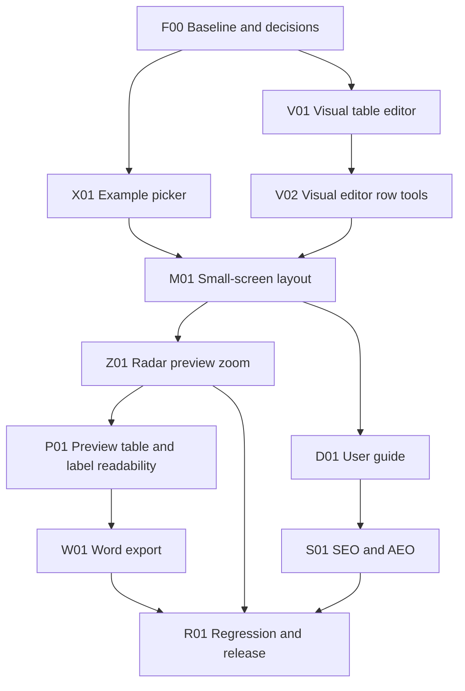

# Feature build plan and delivery tracker

Last updated: 2026-10-08.
Overall state: F00, X01, V01, V02, M01 and D01 verified; product features unreleased.
Next task: **Z01 - Radar preview zoom controls.**

Use this as the execution and progress record for the Technology Radar Live Editor improvements. Use the [implementation prompt](build-prompt.md) to start or resume work. Architecture profile: **static-web-delivery** (browser-only, GitHub Pages; no backend, sign-in or database).

## How to maintain this plan

1. Read the current task table, decisions and handoff before editing code. Verify repository state with `git status` and preserve unrelated changes.
2. Select the next unfinished task whose prerequisites are verified. Set it to `In progress` and record the actual scope.
3. Implement the feature slice, checks and documentation together. Record any changed design in the shared contracts and affected specifications.
4. Update the table with paths or commit references, commands and outcomes. Never invent a commit, deployment or test result.
5. Set `Verified` only after the task's exit checks pass. Set `Blocked` with the specific dependency or missing input, then continue an independent ready task where possible.
6. Update the handoff and delivery log at the end of each session. Synchronise `BACKLOG.md` when a feature meets its release gate.
7. Keep this file small. Delivery-log entries are one or two lines. When a task is Verified, move its task details and older log entries to the [delivery archive](delivery-archive.md); keep only its tracker row with a short evidence summary.

Task states: `Not started`, `In progress`, `Blocked`, `Verified`. Feature release states: `Not released`, `Ready for release`, `Released`. `Verified` means implemented and checked locally, not deployed. Pushing to `main` deploys via [.github/workflows/pages.yml](../../.github/workflows/pages.yml), so pushes require explicit user authorisation.

## Requested features

| # | User request | Workstream |
| --- | --- | --- |
| 1 | Drop-down to choose an example instead of typing a name | X01 |
| 2 | WYSIWYG editor as an alternative to the raw CSV editor | V01, V02 |
| 3 | Good layout on small screens | M01 |
| 4 | Documentation on how to use the tool | D01 |
| 5 | SEO and AEO (answer-engine) enrichment | S01 |
| 6 | Zoom in and out on the radar preview | Z01 |
| 7 | Improve radar preview readability and show its technologies in a formatted table | P01 |
| 8 | Export a radar to a Word-compatible document | W01 |

## Scope and dependencies

Default work order is the table order. X01 and V01 are independent once F00 is verified. S01 metadata that does not depend on guide content (meta tags, robots, canonical) is a safe independent substep after D-01 is decided. This describes technical order, not a requirement for parallel agents.

## Feature progress

| Feature | Required tasks | Release state | Evidence |
| --- | --- | --- | --- |
| Example picker | X01 | Not released | X01 verified locally; see task evidence below. |
| Visual (WYSIWYG) editor | V01, V02 | Not released | V01 and V02 verified locally; release gate remains R01. |
| Small-screen layout | M01 | Not released | M01 verified locally; see task evidence below. |
| Radar preview zoom | Z01 | Not released | Planned; not started. |
| Preview readability and technology table | P01 | Not released | Planned; not started. |
| Word export | W01 | Not released | Planned; not started. |
| User documentation | D01 | Not released | D01 verified locally; static guide, navigation and build checks passed. Release gate remains R01. |
| SEO / AEO enrichment | S01 | Not released | In progress: add app/guide metadata and structured data, crawlable static app text, root discovery files, and focused checks. |

## Task tracker

| ID | Task | Depends on | State | Evidence / blocker |
| --- | --- | --- | --- | --- |
| F00 | Baseline, method bootstrap and decisions | None | Verified | Added method docs and Playwright smoke test. `npm install` passed (0 vulnerabilities); `npm run check`, `npm test`, `npm run build` passed; `npm run test:e2e` passed (1/1); local browser confirmed listed findings. See [baseline](baseline.md). |
| X01 | Example picker drop-down | F00 | Verified | Accessible picker and D-05 shared-link loading verified. `npm run check`, `npm test`, `npm run build` passed; `npm run test:e2e` passed (4/4), including seven examples and v1 view/edit links overriding stored source. Integrated browser loaded a generated view link, showed Preview, and hid Editor. |
| V01 | Visual table editor with two-way CSV sync | F00, D-02 | Verified | Dependency-free Visual/CSV editor with round-trip, validation, invalid-source, undo/redo, persistence, and keyboard checks; see V01 delivery log. |
| V02 | Visual editor row tools (add, delete, duplicate, move, filter) | V01 | Verified | `npm run check`, `npm test`, `npm run build` passed; final `npm run test:e2e` passed 14/14 (6 V02 tests). Single-step undo, header-only deletion, configured defaults, hidden-row preservation, duplicate validation, accessible buttons and keyboard journeys at five widths passed. See [implementation record](v02-visual-row-tools.md) and [baseline](baseline.md). |
| M01 | Small-screen responsive layout | X01, V02, D-04 | Verified | Preview-first startup and cohesive workspace tabs; responsive checks at 360, 390, 768, 1024 and 1280 px. `npm run check`, `npm test`, `npm run build`, and `npm run test:e2e` passed; 15/15 browser tests, no viewport overflow. Real-device checks remain pending. |
| Z01 | Radar preview zoom controls | M01, D-04 | Not started | Add accessible zoom in/out and reset controls for the radar itself; preserve ring/sector meaning, responsive fit, and export behavior. |
| P01 | Preview label readability and formatted technology table | Z01 | Not started | Add translucent neutral backing to radar labels and a formatted table of technologies beneath the selected radar; keep CSV-derived content safe and responsive. |
| W01 | Word-compatible radar export | P01 | Not started | Add a Word-compatible export for the selected radar and its technology table; keep generation client-side and record the chosen file format. |
| D01 | User guide and in-app documentation link | M01, D-03 | Verified | Static guide, shared components, Documentation links, README and build copy implemented. `npm run check`, `npm test`, `npm run build` (inside browser command) passed; `npm run test:e2e` passed 22/22, including 7 guide tests. Crawlable without JS; local links/anchors, control names, keyboard and 360/390/768/1024/1280 px checks passed without guide console errors or page overflow. See [implementation record](d01-user-guide.md) and [baseline](baseline.md). |
| S01 | SEO and AEO enrichment | D01, D-01 | In progress | Add canonical/social metadata and JSON-LD to app and guide; publish robots.txt, sitemap.xml and llms.txt plus a static OG image; keep the app H1 unchanged by loaded CSV data. |
| R01 | Cross-feature regression and release readiness | X01, V01, V02, M01, Z01, P01, W01, D01, S01 | Not started | — |

## Task details and exit checks

Only unfinished tasks are listed. Details for Verified tasks (F00, X01, V01, V02, M01, D01) are in the [delivery archive](delivery-archive.md).

### Z01 — radar preview zoom controls

- Add keyboard-accessible Zoom in, Zoom out and Reset zoom controls to Preview; zoom only the radar graphic, not the page or legend.
- Keep the radar centered and usable at 360, 390, 768, 1024 and 1280 px; prevent category labels from clipping at supported zoom levels.
- Keep zoom as transient view state: do not modify CSV, localStorage, undo history or share payload v1. Reset zoom returns to the default fit.
- SVG, PNG and print output use the default fitted radar, independent of the current on-screen zoom.
- Exit: controls work by mouse and keyboard, have accessible names and stable hit areas, cannot zoom beyond documented bounds, reset returns to fit, no viewport overflow occurs, exports are unscaled, and existing radar/share behavior still passes focused browser tests.

### P01 — preview label readability and technology table

- Give words plotted on the radar a slightly transparent gray background so they remain legible over ring colors.
- Show a neatly formatted table beneath the radar containing the technologies in the selected radar, using the existing radar vocabulary and six-column CSV data as appropriate.
- Keep the preview and table usable at 360, 390, 768, 1024 and 1280 px; safely render all CSV-derived values and preserve the current radar, editor, share and export behavior.
- Exit: table contents match the selected radar and valid source data, labels remain readable without obscuring the radar, keyboard/screen-reader users can understand the table, and focused browser checks show no page overflow or regressions.

### W01 — Word-compatible radar export

- Add a Word-compatible export to the existing export controls for the selected radar, including its formatted technology table.
- Generate the file in the browser without uploading user data or adding a runtime dependency; choose and record the actual file format during implementation.
- Exit: downloaded output opens in a supported Word-compatible application, includes the selected radar and its technologies with useful formatting, handles CSV-derived content safely, and does not change other export behavior.

### S01 — SEO and AEO enrichment

- Head metadata on `index.html` and the guide: unique `<title>`, `meta description`, `link rel="canonical"` (D-01), Open Graph and Twitter card tags, `og:image` (static radar PNG in `public/`), `lang`, `robots`.
- Structured data (JSON-LD): `WebApplication` (name, url, applicationCategory, operatingSystem "Any (browser)", offers price 0, author Ian Tweedie / publisher Mightora) on the app; `HowTo` and `FAQPage` on the guide, with text matching visible content exactly; `BreadcrumbList` on the guide.
- Crawlable content: keep a static `<h1>` for the product name (render the radar name in a separate element rather than overwriting the `<h1>`); add a short visible, static description and a `<noscript>` summary so non-JS crawlers see meaningful text.
- Root files: `robots.txt` (allow all, reference sitemap), `sitemap.xml` (app + guide), `llms.txt` (concise product summary, features, guide and FAQ links) for answer engines. Add them to `scripts/build.mjs`.
- AEO content rules: FAQ answers lead with a direct one-to-two sentence answer; define "technology radar", rings and dot statuses in plain language; state privacy facts (local-first, no account, no upload).
- Do not add analytics, tracking or third-party SEO scripts.
- Exit: JSON-LD parses as valid JSON and matches visible text; built `dist` contains `robots.txt`, `sitemap.xml`, `llms.txt`, OG image; canonical URLs are absolute and match D-01; `<h1>` text is constant after a radar loads; tests assert presence of these tags/files. Release checks: Google Rich Results Test and a social card preview against the deployed URL; Search Console sitemap submission (user action).

### R01 — regression and release readiness

- Re-run all checks; browser journey on desktop and mobile widths: load each example, edit in both modes, validate errors, share link generate/open (subject to D-05), all exports including Word, guide navigation.
- Confirm `dist` contents and that `pages.yml` builds the same artifact.
- Local exit: all checks pass and limitations recorded. Release gate: user-authorised push to `main`, successful Pages run, and the deployed journey plus S01 release checks pass on the live URL.

## Decisions

| ID | Date | Question | Decision | Gates |
| --- | --- | --- | --- | --- |
| D-01 | 2026-10-07 | Canonical production URL and base path? | Decided (user): `https://radar.mightora.io/` at root. Custom domain is configured outside the repo (no `CNAME` file); verify on the live host in R01. | S01 |
| D-02 | 2026-10-07 | How should the WYSIWYG editor relate to CSV? | Decided: dependency-free, DOM-built table; CSV text remains canonical and visual edits serialize through `csvString()` and `setSource()` semantics. Use textareas for text cells to preserve embedded newlines; remember mode in `radar-builder-editor-mode`. | V01 |
| D-03 | 2026-10-08 | Where does user documentation live? | Decided (D01): static `guide/index.html`, copied into `dist/guide/index.html`, linked from header and toolbar. Use relative links for the app/guide round trip. Keep vocabulary synchronized with YAML through tests; guide content and table of contents remain readable without JavaScript. | D01, S01 |
| D-04 | 2026-10-07 | Browser test tooling? | Decided (user): add `@playwright/test` as a devDependency for viewport and journey checks. Set up in F00 (`playwright.config.js`, `npm run test:e2e` against built `dist`, Chromium minimum); local test passed. Not added to `pages.yml`: CI browser installation/reliability has not yet been verified. | M01, R01 |
| D-05 | 2026-10-07 | Fix the uncalled `loadShared()` share-link defect? | Decided (user, 2026-10-07): fix in X01 by loading a valid v1 share payload during startup before falling back to localStorage; test view and edit links. Preserve payload format and privacy warning. | X01, R01 |
| D-06 | 2026-10-07 | Row ordering, filter scope and new-row defaults? | Decided (V02): move against adjacent source rows, including hidden rows; case-insensitive text search across all six cells; radar filter shares the preview selection. Filters are temporary view state, do not write CSV or add history/storage keys. Add appends, clears text search, inherits the selected radar, uses the first configured status/dot labels and focuses the first empty field. Duplicate preserves every value; existing validation reports duplicates. | V02 |

## Delivery log

Newest first; one or two lines per session. Entries up to D01 are in the [delivery archive](delivery-archive.md).

- **2026-10-08** — Added P01 for clearer radar labels and an item table, followed by W01 for Word-compatible export; synchronized the feature index and implementation prompt. Plan-only; no application checks run.
- **2026-10-08** — Efficiency maintenance: moved Verified task details and the delivery log to [delivery-archive.md](delivery-archive.md); slimmed the build prompt to one task per session with focused verification. Docs-only; no application checks run.

## Current handoff

- State: F00, X01, V01, V02, M01, D01 Verified locally; S01 in progress; P01 and W01 planned; all features Not released; `BACKLOG.md` unchanged. No commit, push or deployment performed.
- Last full check (D01): `npm run check`, `npm test`, `npm run test:e2e` (builds first) passed 22/22 in Chromium.
- Known limitation: the app's shared author component requests `/data/config.json` (404); the guide avoids it with an empty inline config.
- Pending release checks (R01): real iOS Safari/Android Chrome, Firefox/WebKit, screen reader, live host at `https://radar.mightora.io/`, successful Pages run after maintainer confirms Settings → Pages → Source → GitHub Actions.
- **Next task: Z01 - Radar preview zoom controls.** First step: mark Z01 In progress. The radar SVG is built as a string in `renderPreview()` ([src/app.js](../../src/app.js#L49), written to `#radarCanvas` at line 88); `#previewPanel` / `.preview-head` in [index.html](../../index.html#L45) hosts the controls. Exports read `#radarCanvas svg` in the `[data-export]` handler ([src/app.js](../../src/app.js#L225)), so apply zoom with CSS on a wrapper, not on the SVG's `viewBox`, to keep exports unscaled. Add `tests/e2e/zoom.spec.js`. P01 and W01 follow Z01; S01 is in progress concurrently.
