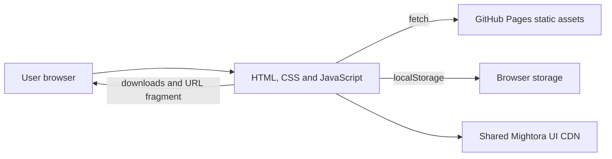

# High-level design

Status: Current design baseline for the planned improvements; existing editor behavior is present, but planned features are not yet verified or released.

## Delivery pattern

The project uses the [static-browser solution pattern](solution-pattern.md): dependency-light browser JavaScript, static HTML/CSS/assets, and GitHub Pages. It has no framework, backend, accounts, database, server storage, analytics, or tracking. Production canonical root is `https://radar.mightora.io/` (D-01); verify the live host during R01.

## Components

| Component | Responsibility | Hosting | Scaling |
| --- | --- | --- | --- |
| Static app | CSV editing, validation, SVG preview, sharing and exports | GitHub Pages, built `dist/` | Static CDN delivery |
| Browser storage | Retain editor source locally | User's browser | Per browser profile |
| Shared UI assets | Header, author and footer components | jsDelivr/shared-ui CDN | Provider-managed |

## Data flow

The browser fetches `public/config/radar-definition.yaml` and example CSV files from the static artifact. CSV editing, parsing, validation, preview rendering, compression, and exports happen in the browser. The source is stored under `radar-builder-source`. A generated share URL carries compressed versioned data in its fragment; the fragment is not sent in ordinary HTTP requests, but anyone with the link can decode it. See [shared contracts](features/shared-contracts.md) and [sharing format](../docs/sharing.md).

## Identity and storage

There are no accounts, authentication, authorization roles, server-side sessions, database, or server-side persistence. Imported data remains in browser memory/storage unless the user downloads it or shares a generated link.

## Deployment and environments

`npm run build` creates `dist/` by copying `index.html`, `src/`, and `public/`. The Pages workflow runs `npm install`, `npm run check`, `npm test`, and `npm run build`, then deploys `dist` for `main` pushes or manual dispatch. The app is served from the custom-domain root; runtime static fetch paths use `public/config/` and `public/examples/`. No deployment was performed for this baseline.

## Non-functional targets

| ID | Target | How it is verified |
| --- | --- | --- |
| NFR-01 | User radar data is processed locally except when the user shares a link | Browser inspection and journey tests; live network inspection remains a release check |
| NFR-02 | The static build works at the production root URL | Local built-browser journey and authorised deployed check |
| NFR-03 | User-entered CSV values cannot inject markup into rendered HTML | Focused tests and browser security checks in implementation tasks |
